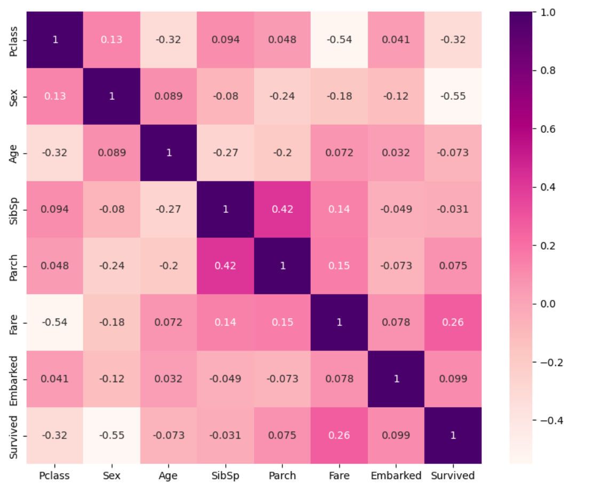
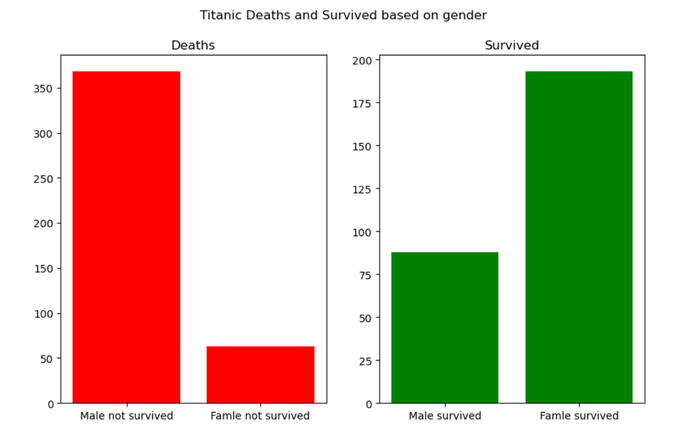
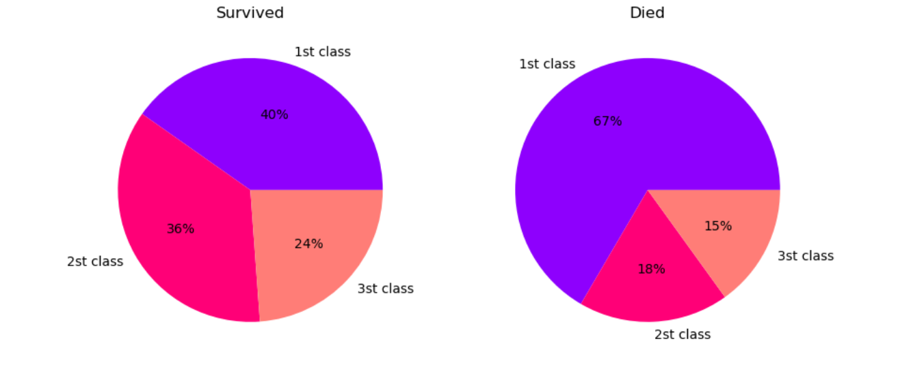
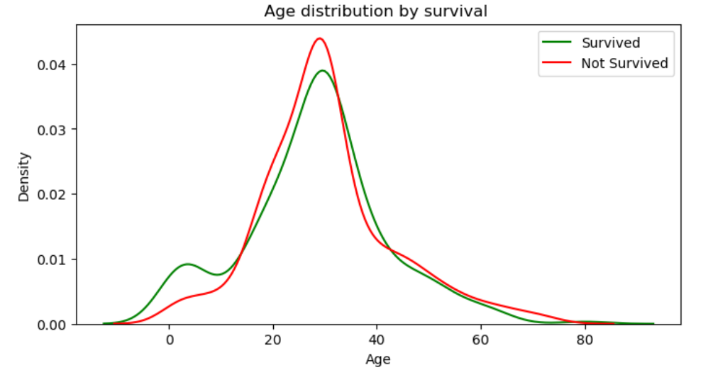

# Titanic dataset
### Supervised Learning Flow

### Table of Contents

  
Table of Contents

  - [About The Project](#about-the-project)
  - [Built With](#built-with)
  - [Getting Started](#getting-started)
    - [Prerequisites](#prerequisites)
  - [Usage](#usage)
  - [Process](#process)
  - [Demo Video](#demo-video)

## About The Project
In this project, we explore various supervised learning techniques to build effective predictive models. We focus on four popular algorithms: K-Nearest Neighbors (KNN), Naive Bayes, Random Forest, and Gradient Boosting. Through the use of feature engineering, hyperparameter optimization, and cross-validation techniques, we aim to enhance the accuracy and robustness of these models. The performance of each model is evaluated using metrics such as accuracy and precision, providing insights into their strengths and weaknesses for different datasets.
### Correlation Heatmap

The following heatmap shows the correlation between various features in the dataset:

### Titanic Deaths and Survivals by Gender

The following graph illustrates the comparison between the number of deaths and survivors based on gender:

### Survived vs Died by Class

The following pie charts compare the percentages of passengers who survived and died based on their class:

### Age Distribution by Survival

The following density plot shows the age distribution of passengers who survived and did not survive:

### Built With
* Programming Languages: Python
* Libraries: Pandas, NumPy, Scikit-learn, Matplotlib, Seaborn
* Techniques: Supervised learning, feature engineering, cross-validation, grid search, etc'

## Getting Started
### Prerequisites
Make sure you have the following installed:

* Python 3.x – Download from here.
* Pip – Python’s package manager for installing dependencies.
* Jupyter Notebook – Install it via pip install notebook.
* Required Libraries – Install by running

## Usage
* Clone the repository.
* Open the Assignment2_supervised_learning_flow.ipynb in Jupyter Notebook.
* Run the cells to execute the code and view results.
* Modify parameters or models in the notebook to experiment.

## Process
Loading and preparing the dataset.
Performing Exploratory Data Analysis (EDA) – handling duplicates, NULL values, and visualizing data.
Testing multiple learning algorithms to establish a baseline F1 score.
Conducting 5-fold cross-validation to select the best algorithm.
Training the dataset with the best-performing model.
Creating a confusion matrix and visualizing model performance.

## Demo Video
[Click here to watch the demo video](https://www.youtube.com/watch?v=GpCbY-wfVFE&t=1s)

